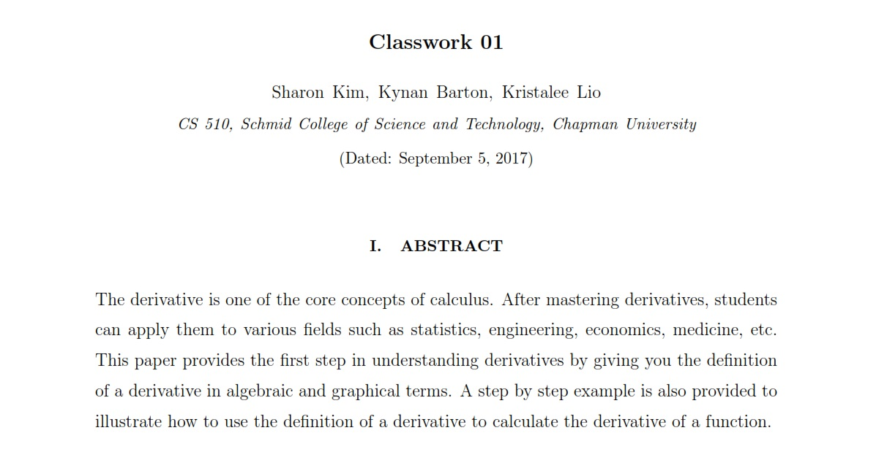

# CS510 CW 1

**Author(s):** _\Sharon Kim, Kynan Barton, Kristalee Lio\>_

## Specification

Complete the following exercises, saving your solutions in the indicated files. 

1. Create a LaTeX file ```testlatex.tex``` (using the template in the ```info``` repository). In this file write an explanation of what the definition of the derivative $f'(x)$ of a function $f(x)$ means.  Include both inline and numbered equations, as well as a proper title, abstract, and section headings. Find a suitable image to illustrate your definition online, and include it as a figure, with proper citation of the source. After ensuring that your LaTeX file compiles properly to pdf, commit only the source file ```testlatex.tex``` to GitHub in this repository.
1. Create a Sage Math Worksheet ```testsage.sagews```. Explore the menus to see what it can do, and demonstrate a few neat examples that you like. Give the document a properly formatted header and sections, as well as some text describing what you chose and why. Commit the file to GitHub in this repository.

## Assessment

Analyze in this section what you found useful about this assignment in your own words. Include any lingering questions or comments that you may have.

**This classwork assignment was useful because it helped our group collaborate with one another in completing a task, even when we could not physically meet with one another.  It also helped the group practice cloning, pushing, and pulling the files in our repository. We were able to familiarize ourselves with latex as well as sage. **

## Honor Pledge

I pledge that all the work in this repository is my own with only the following exceptions:

* Content of starter files supplied by the instructor;
* Code borrowed from another source, documented with correct attribution in the code and summarized here.

Signed,

**Sharon Kim, Kynan Barton, Kristalee Lio**

testlatex.tex

